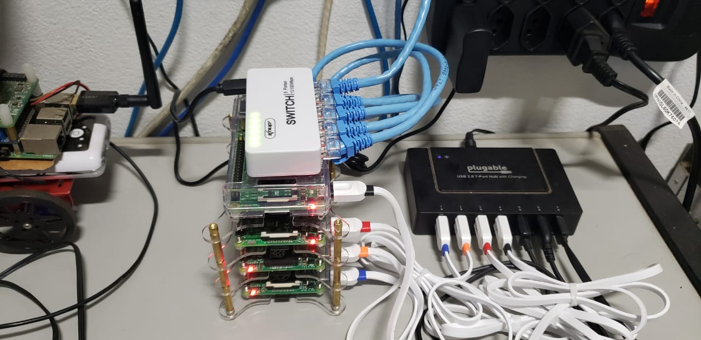

# Raspberry Pi Kubernetes Cloud

## Cloud-In-A-Box

Kubernetes greatly reduces the time and effort it takes to deploy. Kubernetes also provides facilities to help you implement continuous deployment practices. Then add to this orchestration the Docker's containers, to provide the potential for "write once, run anywhere" cloud applications. 

In summary, you can have a cloud-based environment where you can learn to build, test, and deploy containerized distributed micro-services for your IoT projects or embedded systems.

To complete this scenario, we are running on Raspberry PI platform. We can call this "cloud-in-a-box".

## Checklist items

I decide to use the [HypriotOS](https://blog.hypriot.com/), which is a minimal Debian-based operating systems that is optimized to run Docker ecosystem on any Raspberry Pi.

Below is a list of items used in this project.

### List of Software

- HypriotOS
- Docker
- Kubernetes

### List of Hardware

- 4 Raspberry Pi, including Pi 2 and Pi 3
- 4 16 GB MicroSD cards - class 10
- 4 short USB to Micro USB cables
- 1 60 W power supply with USB outlets
- 5 short cat 5 ethernet network cables
- 1 network hub switch

Here is my final construction, up and running.




## Customization

The HypriotOS is installed with some default properties that we need to change like user name, host name, IP address and some others properties. 

### Change user name

You can change or use the same user name provided by default. I just created a new user name *pidock*. You can check this [link](https://www.raspberrypi.org/documentation/linux/usage/users.md#:~:text=Create%20a%20new%20user,don't%20want%20a%20password.) for more details about how to create a new user.

As we are building a cluster with 4 Raspberry PIs, the IP and hostname of each device must be static. So, I did the following changes in my environment:

```
rpi-master   192.168.0.30
rpi-node-1   192.168.0.31
rpi-node-2   192.168.0.32
rpi-node-3   192.168.0.33
```

You can use any other IP set that you want.

### Change hostname

To change the hostname and make it static, you need do the following:

1. Change the preserve_hostname in cloud.cfg file from `false` to `true`
2. Edit the /etc/hostname file and type the hostname string that you want.
3. Reboot

Now you will see the new hostname that you have chosen.

If you want to access each Pi using its hostname instead of the IP, you can run the following commands to add additional info to /etc/hosts:

```sh
echo -e "192.168.0.30\rpi-master" | sudo tee -a /etc/hosts
echo -e "192.168.0.31\rpi-node-1" | sudo tee -a /etc/hosts
echo -e "192.168.0.32\rpi-node-2" | sudo tee -a /etc/hosts
echo -e "192.168.0.33\rpi-node-3" | sudo tee -a /etc/hosts
```

### Set up the static IP address

To apply static IP address, we need change the configuration of an interface, eg. *eth0*, changing it to static IP. We can do this editing the file /etc/dhcpcd.conf, using the following command in the rpi-master Pi:

```
sudo nano /etc/dhcpcd.conf
```

Then add the following lines

```
interface eth0
static ip_address=192.168.0.130/24
static routers=192.168.0.1
static domain_name_servers=192.168.0.1
```

Then just repeat the same process to all other Pi nodes, but using the correct IP number for each Pi.

## Installing the master node

Now we can install the Kubernetes to rpi-master, that will be the master node.

Now we're ready to install the Kubernetes k3s. On the master Pi, run:

```sh
curl -sfL https://get.k3s.io | sh -
```

When the command finishes, we already have the master node cluster set up and running! Let's check it out. Still on the rpi-master, run:

```sh
sudo kubectl get nodes
```

You should see something similar to:

```sh
NAME     STATUS   ROLES    AGE    VERSION
rpi-master  Ready    master   4m44s  v1.18.8-k3s.1
```

### Adding aditional nodes

After installing **k3s**, a join token in created in the master node's filesystem. We can check it using the command:

```sh
sudo cat /var/lib/rancher/k3s/server/node-token
```

Now, log into one node, eg. rpi-node-1, to install the k3s. We will repeat the command used in master, but with some extra parameters. Replace the string **paste_join_token_here** with the join token generated when installing k3s in master, as described above.

```sh
curl -sfL http://get.k3s.io | K3S_URL=https://192.168.0.130:6443 \
K3S_TOKEN=paste_join_token_here sh -
```

Note that K3S_URL is the IP address of master. Here is the output that I got:

```
$ curl -sfL http://get.k3s.io | K3S_URL=https://192.168.0.130:6443 \
> K3S_TOKEN=paste_join_token_here sh -
[INFO]  Finding release for channel stable
[INFO]  Using v1.18.8+k3s1 as release
[INFO]  Downloading hash https://github.com/rancher/k3s/releases/download/v1.18.8+k3s1/sha256sum-arm.txt
[INFO]  Downloading binary https://github.com/rancher/k3s/releases/download/v1.18.8+k3s1/k3s-armhf
[INFO]  Verifying binary download
[INFO]  Installing k3s to /usr/local/bin/k3s
[INFO]  Creating /usr/local/bin/kubectl symlink to k3s
[INFO]  Creating /usr/local/bin/crictl symlink to k3s
[INFO]  Skipping /usr/local/bin/ctr symlink to k3s, command exists in PATH at /usr/bin/ctr
[INFO]  Creating killall script /usr/local/bin/k3s-killall.sh
[INFO]  Creating uninstall script /usr/local/bin/k3s-agent-uninstall.sh
[INFO]  env: Creating environment file /etc/systemd/system/k3s-agent.service.env
[INFO]  systemd: Creating service file /etc/systemd/system/k3s-agent.service
[INFO]  systemd: Enabling k3s-agent unit
Created symlink /etc/systemd/system/multi-user.target.wants/k3s-agent.service → /etc/systemd/system/k3s-agent.service.
[INFO]  systemd: Starting k3s-agent
```

Then repeat the same process to all your remaining nodes.

At final, you can test your cluster running the command:

```sh
kukectl get nodes
```

And you will get something similar to this:

```sh
rpi-node-1   Ready    worker   3h10m   v1.18.8+k3s1
rpi-node-2   Ready    worker   77m     v1.18.8+k3s1
rpi-node-3   Ready    worker   63m     v1.18.8+k3s1
rpi-master   Ready    master   11h     v1.18.8+k3s1
```

Congrats! You have all your nodes working in your Kubernetes cluster!

## References

* [How to Install Kubernetes in a Raspberry Pi Cluster](https://medium.com/better-programming/how-to-install-kubernetes-on-a-raspberry-pi-cluster-49ad9a762d08)
* [Build a Kubernetes Cloud on a Raspberry Pi](https://kurtstam.github.io/2015/12/04/Build-a-Kubernetes-Cloud-on-Raspberry-Pi.html#2)
* [Run Kubernetes on a Raspberry Pi with 3ks](https://opensource.com/article/20/3/kubernetes-raspberry-pi-k3s)
* [How to Set Up a Raspberry Pi Cluster](https://medium.com/better-programming/how-to-set-up-a-raspberry-pi-cluster-ff484a1c6be9)
